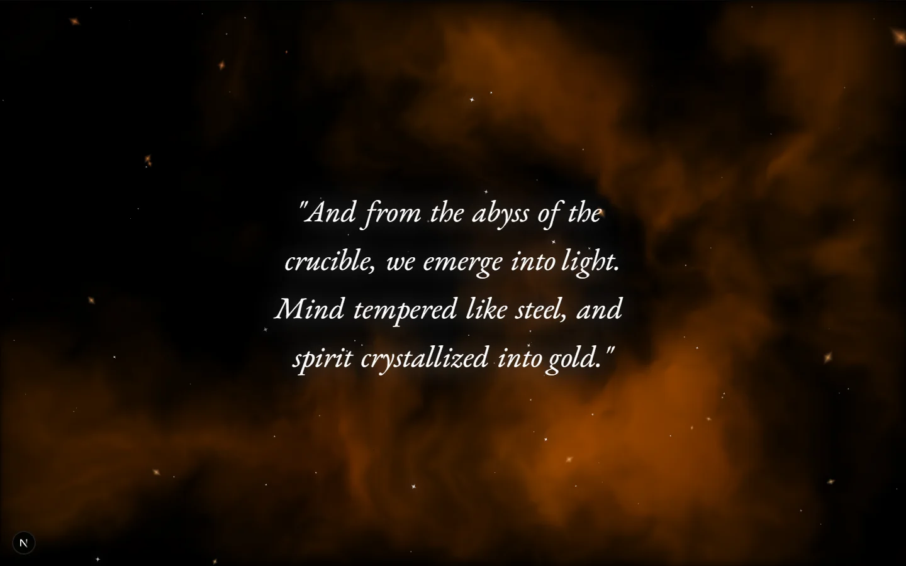
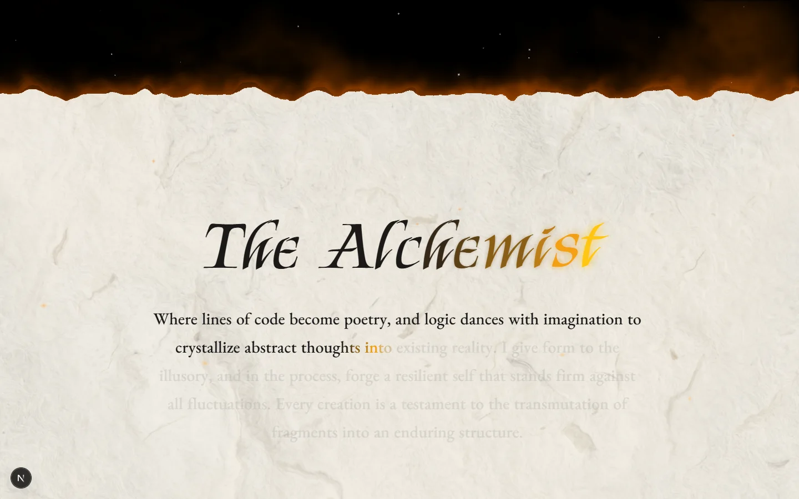
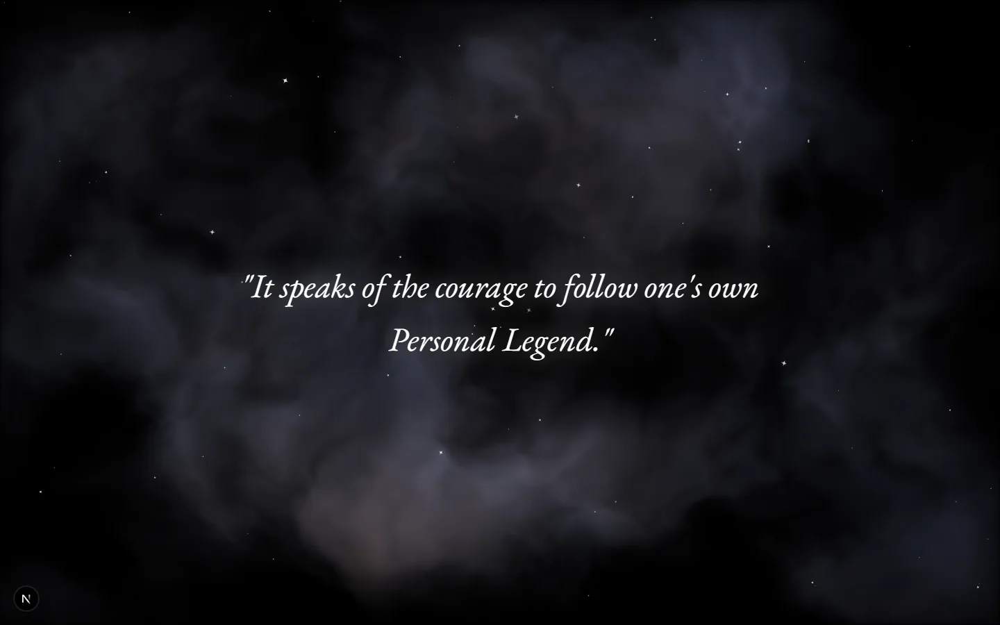
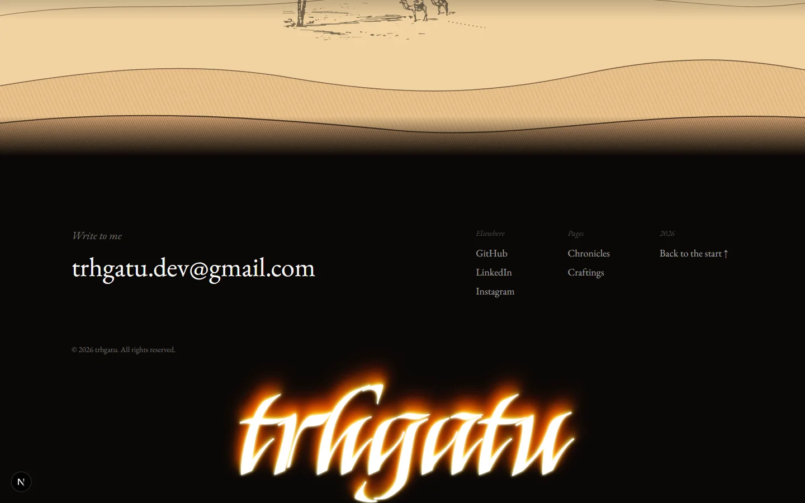
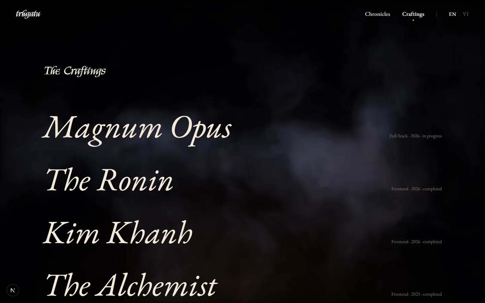
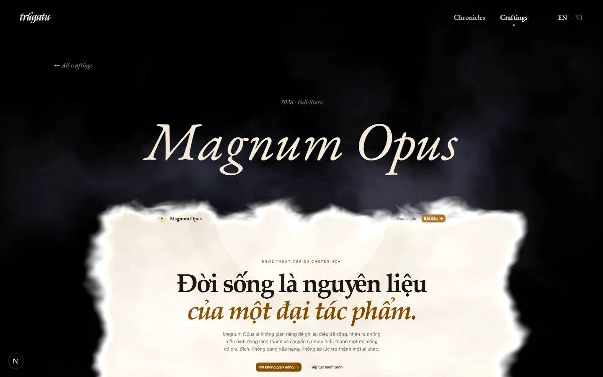

# The Alchemist

**English** | [Tiếng Việt](README.vi.md)

> _"In the alchemical dance of existence, nothing new can be born until the old is surrendered."_

My portfolio, written as a book after Paulo Coelho's _The Alchemist_. Not a list of jobs, but the story of how I learned to make things, told in the shape of the Great Work: it begins at the forge, passes through the night, and ends at dawn in the desert.

**Live:** [thatu.is-a.dev](https://thatu.is-a.dev) · in English and Vietnamese


## The book

### Prologue

Every alchemist begins with a name and a fire. Three sayings open the book, and between them they hold all of it: the old must be let go, trial is what tempers the will, and whoever comes out of the crucible comes out changed.




### I. The Alchemist

How I came to make things, told in the four stages of the Great Work. **Nigredo**, the years spent lost in the dark. **Albedo**, the first lines of code and the small flame they lit. **Citrinitas**, the night it all finally made sense. **Rubedo**, the work that is still going on.




### II. The grimoire

The tools I have learned, kept like spells in an old book. Released from its pages, they become the stars I work under.


### III. The craftings

What the fire has made so far. Each work is a star on its own orbit, and each has its own page.


### IV. The journey

The night gives way to dawn. The book ends where Santiago's story does, in the desert, with the word that was there before any of it began: _Maktub_, it is written.




### The last page

An invitation to write.



### The works, one by one

Every work also has a page of its own, with its story, its materials and more of its pictures.




## Behind the pages

- **The name** is a single WebGL2 shader (OGL): the paper, the letters and the fire inside them. The letters are drawn once into a mask, so they stay sharp however close the camera comes.
- **The mist frames** around every photograph and screenshot are a shader that dissolves the edges into fog and stirs it toward the cursor.
- **The grimoire** is a React Three Fiber scene: the book, its magic circle and the tech stack it releases.
- **Between pages**, an OGL noise shader burns the screen out and back in.

### Keeping it smooth

- **One clock.** Lenis, GSAP, the OGL shaders and the R3F scenes all run on one `gsap.ticker` (`src/lib/frame.ts`). Lenis goes first, so every frame draws against a settled scroll position.
- **Only draw what is seen.** Each effect stops drawing when it is off screen or faded out.
- **Few WebGL contexts.** All mist frames render into one shared canvas through drei's `<View>`.
- **Cheap properties only.** Animation stays on transforms, opacity and shader uniforms. There are no animated blurs or text shadows.
- **Quality tiers** (`src/lib/quality.ts`). Low-memory devices, modest phones and visitors who prefer reduced motion get lighter shaders. Everyone else gets a short frame-rate check, and the tier drops if the machine struggles. `?quality=high` or `?quality=low` forces either one.

## Stack

- **[Next.js 15](https://nextjs.org)** (App Router, Turbopack) · **React 19** · **TypeScript**
- **[GSAP](https://gsap.com)** with `ScrollTrigger`, and **[Lenis](https://lenis.darkroom.engineering)** for smooth scroll
- **[React Three Fiber](https://r3f.docs.pmnd.rs)** and **drei**
- **[OGL](https://github.com/oframe/ogl)** for the full-screen shaders
- **Zustand** for app state and the EN / VI language store, and **TanStack Query** for project data
- **Tailwind CSS v4**, typeset in Kings and EB Garamond

## Running it

```bash
pnpm install
pnpm dev
```

Open [localhost:3000](http://localhost:3000). The works live in `src/features/alchemist/craftings/constants/mock-projects.ts`, and the site's text, in both languages, in `src/constants/translations.ts`.

## Credits

The story borrows its shape and its sayings from Paulo Coelho's _The Alchemist_. The code is MIT licensed (see [LICENSE](LICENSE)).

---

Made by **trhgatu**. [GitHub](https://github.com/trhgatu)

**Maktub.**
