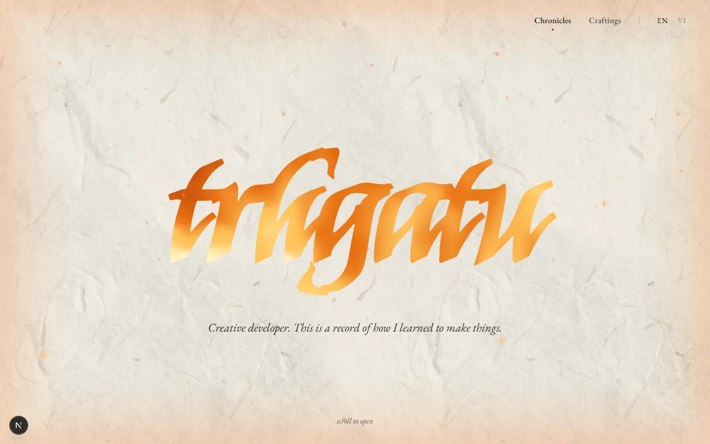
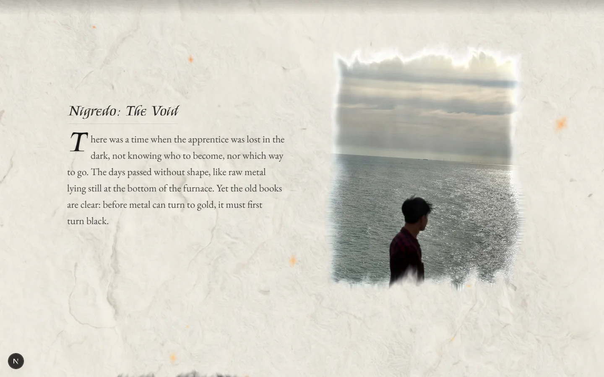
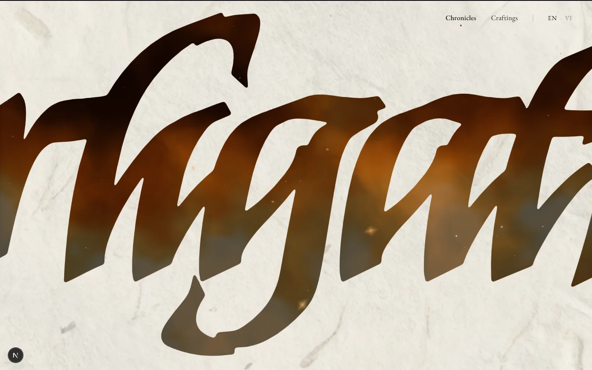
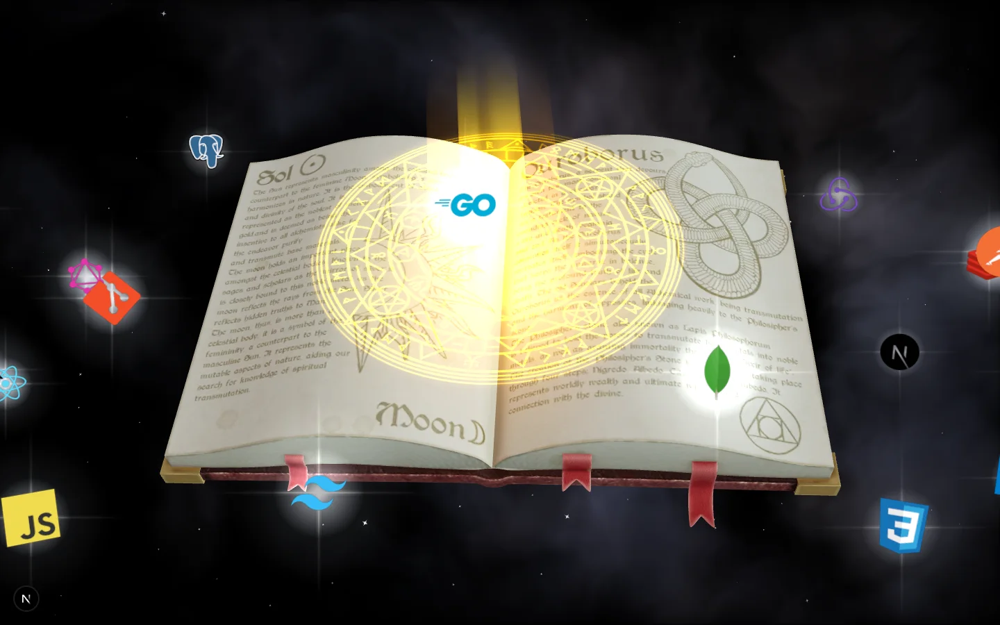
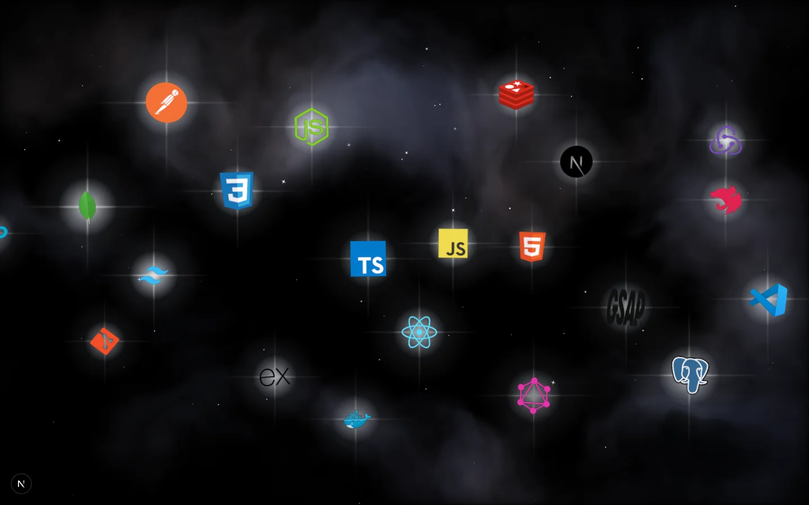
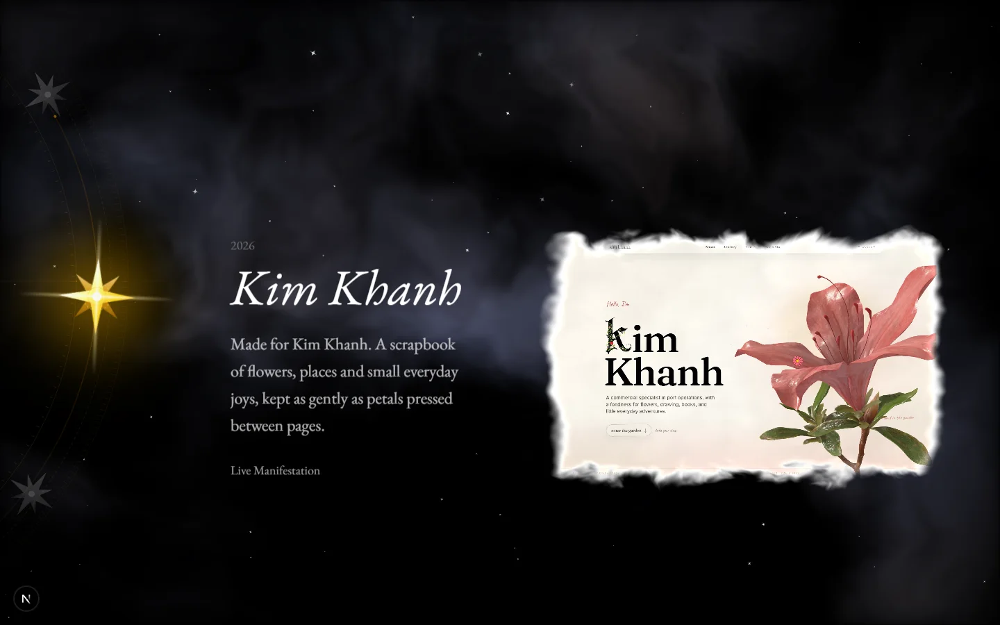
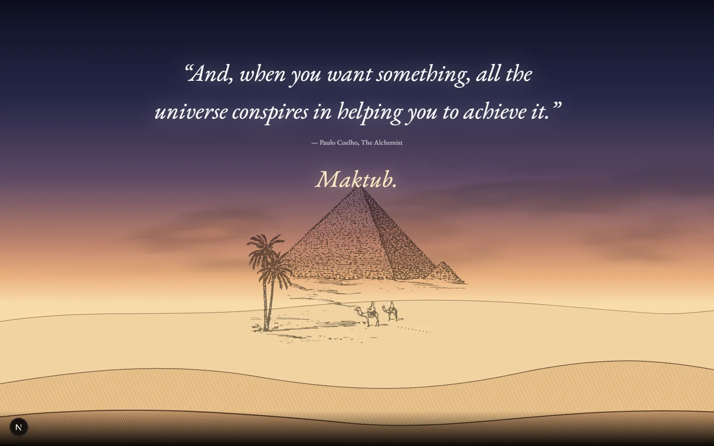

# The Alchemist

[English](README.md) | **Tiếng Việt**

> _"Trong điệu vũ giả kim của sự tồn tại, cái mới không thể thành hình cho đến khi cái cũ được buông bỏ."_

Portfolio này không phải một bản lý lịch. Nó là ghi chép về cách tôi học cách tạo tác: gom nhặt những mảnh vỡ, bước vào lò luyện, và dùng toán học cùng mã lệnh để định hình lại thực tại.

**Trải nghiệm trực tiếp:** [thatu.is-a.dev](https://thatu.is-a.dev) (song ngữ EN / VI)

Lấy cảm hứng từ _Nhà Giả Kim_, toàn bộ không gian này được dựng nên như một cuốn sách cổ, trải qua bốn giai đoạn chuyển hoá:

- **Nigredo (Hắc hoá):** màn đêm của sự hoang mang, nơi mọi ảo tưởng cũ buộc phải cháy rụi thành tro.
- **Albedo (Bạch hoá):** đốm lửa nhen nhóm từ những dòng code sơ khai, tìm kiếm trật tự trong hỗn mang.
- **Citrinitas (Hoàng hoá):** khoảnh khắc thức tỉnh, khi tư duy kiến trúc và mỹ cảm bắt đầu hợp nhất.
- **Rubedo (Hồng hoá):** Đại Công Trình tiếp diễn, tạo ra những tác phẩm có thể tự đứng vững và phát sáng.

## Phía sau lò luyện

Mỗi trang sách, ngọn lửa hay làn sương trên màn hình đều không phải video dựng sẵn. Chúng được vẽ ra theo thời gian thực, từng pixel một.

**Tự sự bằng shader.** Cái tên mở đầu và ngọn lửa ngầm trong từng nét chữ là một shader WebGL2 (OGL), sắc nét ở mọi cự ly. Những khung viền tan vào sương quanh mỗi tấm ảnh cũng là shader viết tay, cuộn theo con trỏ của người xem.

**Cổ thư và chòm sao.** Một không gian ba chiều dựng bằng React Three Fiber, nơi các công cụ kỹ thuật rời khỏi trang giấy để trở thành những tọa độ dẫn đường.

|              Cổ thư               |                Chòm sao                |
| :-------------------------------: | :------------------------------------: |
|  |  |

**Kỷ luật của hiệu năng.** Một trải nghiệm thị giác chỉ có giá trị khi nó mượt mà.

- Mọi chuyển động (Lenis, GSAP, OGL, R3F) cùng chạy trên một nhịp `gsap.ticker` duy nhất, nên không lớp nào lệch nhịp hay giật so với lớp nào.
- Mọi khung sương mù vẽ chung trên một WebGL context nhờ `<View>` của drei.
- Hệ thống tự đo sức tải của phần cứng (`src/lib/quality.ts`) để hạ cấp shader trên thiết bị yếu. Cái đẹp phải đến được với người xem mà không làm bỏng tay họ.

|            Các tác phẩm            |             Maktub              |
| :--------------------------------: | :-----------------------------: |
|  |  |

## Chất liệu

- **Lõi:** Next.js 15 (App Router, Turbopack) · React 19 · TypeScript
- **Thị giác và chuyển động:** OGL · React Three Fiber và drei · GSAP và ScrollTrigger · Lenis
- **Cấu trúc và dữ liệu:** Tailwind CSS v4 · Zustand · TanStack Query
- **Kiểu chữ:** Kings · EB Garamond

---

Một ghi chép của **trhgatu**. [GitHub](https://github.com/trhgatu)

**Maktub.**
